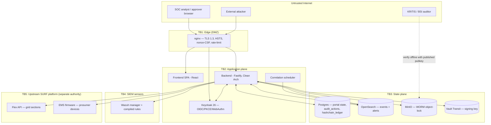

# Threat Model — SURF Security Companion

| | |
|---|---|
| **Version** | 1.0 (draft for pen-test / KRITIS review) |
| **Date** | 2026-07-16 |
| **Methodology** | STRIDE per data-flow element, over an architecture-derived DFD |
| **Scope** | This repository and the container images built from it (the SOC portal, its correlation/crypto pipeline, and its adapters). |
| **Out of scope** | The upstream SURF platform — Flex API, EMS firmware, digital twin, VNB re-identification vault — each of which has its own disclosure process (see [`SECURITY.md`](../SECURITY.md)). Physical grid hardware. |
| **Status** | Living document. This is the artefact P1 #7 asks an independent assessor to validate; the threat register below is the starting hypothesis, not a completed penetration test. |

> **How to use this document.** §2–§5 establish what we are protecting and from whom.
> §6 is the working threat register (STRIDE). §7 walks the highest-consequence kill-chains
> end to end. §8 states the assumptions the whole model rests on — if an assumption is false,
> re-open every threat that leans on it. §9 ties residual risk to the P1 hardening backlog.

---

## 1. What makes this system unusual

This is not a generic web app. It is a **SOC portal for a KRITIS energy operator**, and two
properties dominate the threat picture:

1. **It can act on physical infrastructure.** A playbook can `quarantine` prosumer
   Energy-Management-Systems (`EmsConnector`, [`connectors.ts`](../backend/src/domain/ports/connectors.ts))
   and revoke Keycloak sessions in bulk. An attacker who drives these is causing a
   **grid-availability incident**, not a data breach. Integrity/availability of the *action path*
   outranks confidentiality.
2. **Its product is tamper-evidence.** The value proposition of the audit ledger, Merkle
   rollups, and WORM store is that a regulator can trust them. An attacker who can forge or
   silently rewrite that evidence defeats the reason the system exists. This is why the
   hash-chain signing key moved into Vault Transit (P1 #4) — see [`SECRETS.md`](SECRETS.md).

Everything below is prioritised through those two lenses.

---

## 2. System overview & trust boundaries

Derived from [`ARCHITECTURE.md`](ARCHITECTURE.md) and `docker-compose.yml`. Dashed boxes are
trust boundaries; a data flow that crosses one is where controls must live.

### Trust boundaries

| ID | Boundary | Why it matters |
|----|----------|----------------|
| **TB1** | Internet → nginx | Sole ingress; TLS termination, CSP, rate-limit, request-id minting. |
| **TB2** | nginx → app plane | Authn/authz enforced here; the SPA is untrusted (runs in the analyst's browser). |
| **TB3** | app → state plane | Where confidentiality, integrity and tamper-evidence are realised (Postgres/OpenSearch/MinIO/Vault). |
| **TB4** | app → SIEM sensors | Detection roster shared with Wazuh; divergence is a detection-integrity risk. |
| **TB5** | app → upstream SURF | The **physical-impact** boundary: EMS quarantine, session revocation, Flex reads. Different security authority. |
| **TB6** | tenant ↔ tenant | Logical isolation via `tenant_id`; not a network boundary. |
| **TB7** | operator ↔ operator | Separation of duties (four-eyes) on mass actions. |

---

## 3. Assets & security objectives

| # | Asset | C | I | A | Primary objective |
|---|-------|---|---|---|-------------------|
| A1 | **Grid-control action path** (EMS quarantine, session revoke) | – | ●●● | ●●● | No unauthorised or un-approved bulk action reaches TB5. |
| A2 | **Audit ledger** (`audit_actions`, hash-chained) | ● | ●●● | ●● | Append-only; any tamper is detectable. |
| A3 | **Merkle rollups + WORM receipts** | ● | ●●● | ●● | Independently verifiable by an auditor offline. |
| A4 | **Hash-chain signing key** (Vault Transit) | ●●● | ●●● | ●● | Private key never leaves Vault/HSM. |
| A5 | **Prosumer data** (pseudonymised) | ●●● | ●● | ● | SOC holds only pseudonyms; no re-identification here. |
| A6 | **Compliance evidence** (NIS2 reports, KRITIS bundles) | ●● | ●●● | ● | Genuine, complete, attributable. |
| A7 | **Detection roster** (Sigma → portal + Wazuh) | ● | ●●● | ●● | Two evaluators stay conformant; rules can't be silently disabled. |
| A8 | **Operator credentials / sessions** | ●●● | ●●● | ●● | MFA-backed; phishing/replay resistant. |

(C/I/A weighting: ●●● critical, ●● high, ● moderate, – n/a.)

---

## 4. Threat actors

| Actor | Motivation | Capability | Notes |
|-------|-----------|-----------|-------|
| **External unauthenticated** | Disruption, ransom, geopolitical | Network access to TB1 only | Must defeat authn to reach anything. |
| **Compromised analyst account** | Whatever the phisher wants | A valid low/mid-privilege session | The realistic "assume breach" starting point. |
| **Malicious insider (single operator)** | Sabotage, coercion | Legitimate operator role | Four-eyes (TB7) is the control specifically for this actor. |
| **Compromised dependency / image** | Supply-chain foothold | Code execution in a container | cosign/SBOM/Trivy are the controls; see T-SC below. |
| **Curious/hostile tenant** | See another tenant's data | Valid tenant-scoped session | TB6 isolation is the control. |
| **Hostile upstream / MITM on TB5** | Feed false grid state, forge device acks | Network position between backend and Flex/EMS | Depends on upstream mTLS — an explicit assumption (§8). |

---

## 5. Existing security controls (baseline)

Enumerated so the threat register can reference them by name.

- **C-AUTHN** — OIDC + PKCE, WebAuthn primary / OTP fallback (MFA), enforced by Keycloak.
- **C-JWT** — bearer-token verification in [`authz.ts`](../backend/src/infrastructure/http/middleware/authz.ts): `iss`/`aud`/`exp`/`nbf` via JWKS, role allow-list, builds `req.caller`. Token is carried in the `Authorization` header, **not a cookie** → classic CSRF does not apply.
- **C-TENANT** — `tenantScope` guard rejects explicit cross-tenant params *and* every repository query filters `WHERE tenant_id = $claim` (defence in depth).
- **C-4EYES** — mass actions above `massActionThreshold` (default **10**) park in `REQUESTED`, page on-call, and require an approver where `approver ≠ requester` ([`playbookService.ts`](../backend/src/application/playbooks/playbookService.ts)).
- **C-DRYRUN** — playbooks default to dry-run; real execution is explicit and reversible (`priorMode`/`priorState` captured).
- **C-LEDGER** — `audit_actions` SHA-256 hash-chained; Postgres trigger forbids UPDATE/DELETE.
- **C-ROLLUP** — hourly Ed25519-signed Merkle roots to Postgres + MinIO WORM; each chains to the previous; verify is public-key-local.
- **C-VAULT** — signing key in Vault Transit (P1 #4); private key never leaves Vault.
- **C-WORM** — MinIO object-lock (compliance retention) on rollups and export bundles.
- **C-EDGE** — TLS 1.3 only, HSTS preload, nonce-CSP, `frame-ancestors 'none'`, per-instance rate-limit (1-min window).
- **C-SUPPLY** — distroless non-root read-only-FS containers, dropped caps, cosign-signed images (Rekor), CI Trivy/CodeQL/Gitleaks, CycloneDX SBOM.

---

## 6. STRIDE threat register

Risk = Likelihood × Impact → **Low / Medium / High / Critical**, *after* existing controls
(i.e. residual). "→ P1 #n" links a residual to the hardening backlog ([`FUTURE_WORK.md`](../FUTURE_WORK.md)).

### Spoofing

| ID | Threat | Boundary | Mitigations | Residual |
|----|--------|----------|-------------|----------|
| S1 | Attacker forges/reuses a JWT to impersonate an analyst | TB2 | C-JWT (sig+iss+aud+exp+nbf), short token TTL, JWKS rotation | **Low** — depends on Keycloak key hygiene (§8). |
| S2 | Credential phishing / MFA fatigue against an operator | TB1/A8 | C-AUTHN (WebAuthn phishing-resistant primary) | **Medium** — OTP fallback is phishable; prefer WebAuthn-only for approvers. |
| S3 | Spoofed upstream EMS/Flex endpoint feeds false device state or forges a quarantine ack | TB5 | Assumed upstream mTLS (§8) | **High if assumption fails** — no app-layer signature on EMS responses. Track as open. |

### Tampering

| ID | Threat | Boundary | Mitigations | Residual |
|----|--------|----------|-------------|----------|
| T1 | Insider rewrites history in `audit_actions` | TB3/A2 | C-LEDGER (hash-chain + UPDATE/DELETE trigger), C-ROLLUP | **Low** — DB-superuser who can drop the trigger is the residual; see T2. |
| T2 | DB-superuser / backup-restore rewrites Postgres *and* re-derives a consistent chain | TB3 | Requires also forging C-VAULT signature (key in Vault) + overwriting C-WORM (object-lock) | **Low→Medium** — the point of moving the key to Vault; strong only if Vault token isn't co-located with DB admin. |
| T3 | Forge a Merkle rollup signature | A3/A4 | C-VAULT — private key never leaves Vault; sign requires `transit/sign` cap | **Low** while the Vault signing token is protected. |
| T4 | Silently disable/weaken a detection rule so an attack isn't recorded | TB4/A7 | Conformance gate (portal vs Wazuh, CI), Sigma is source of truth in git | **Medium** — a rule *deletion* in git is caught by review, not runtime; add a rollout alert on roster count drop. |
| T5 | Tamper with events in OpenSearch before the hourly rollup captures them | TB3/A2 | ≤1 h exposure window; post-rollup tamper is detected by re-derivation on verify | **Medium** — sub-hour tamper of not-yet-rolled events is undetectable. Consider streaming/continuous anchoring. |

### Repudiation

| ID | Threat | Boundary | Mitigations | Residual |
|----|--------|----------|-------------|----------|
| R1 | Operator denies ordering a mass quarantine | TB7/A2 | C-4EYES records requester+approver, C-LEDGER binds action to `caller.username`, pgaudit | **Low**. |
| R2 | Approver claims they never approved | A2 | Same; approval is a distinct audited action | **Low** — strengthen by requiring WebAuthn re-auth at the approval step. |

### Information disclosure

| ID | Threat | Boundary | Mitigations | Residual |
|----|--------|----------|-------------|----------|
| I1 | Tenant A reads Tenant B's cases/alerts | TB6/A5 | C-TENANT (guard + `WHERE tenant_id`) | **Medium** — highest-value logic bug class; **primary pen-test target**. Every new query/aggregation is a fresh chance to leak. |
| I2 | Re-identification of a prosumer from SOC data | A5 | Pseudonyms only; re-id is at the VNB under separate controls ([`gdprService.ts`](../backend/src/application/gdpr/gdprService.ts)) | **Low** at the SOC; correlation-based re-id across events is the residual. |
| I3 | Secrets leak via logs/errors | TB2 | Pino path-redaction + value-scrubbing of configured secrets | **Low→Medium** — a newly added secret not registered for scrubbing leaks. Add a lint/test that every config secret is scrubbed. |
| I4 | Presigned MinIO URL over-shared / long-lived | A3/A6 | Short `presignExpirySeconds` | **Medium** — verify expiry is tight and URLs aren't logged. |
| I5 | Verbose stack traces / version banners aid recon | TB1 | Structured errors, typed error mapping | **Low**. |

### Denial of service

| ID | Threat | Boundary | Mitigations | Residual |
|----|--------|----------|-------------|----------|
| D1 | Credential-stuffing / brute force on login-adjacent endpoints | TB1/A8 | C-EDGE rate-limit, Keycloak lockout | **High** — rate-limit is **per-instance in-memory**; with N backend replicas effective limit ×N. **→ P1 #5** (Redis-backed shared limiter). |
| D2 | Flood ingest to bloat OpenSearch / delay rollups | TB3 | Index lifecycle, scheduler windowing | **Medium** — no explicit ingest quota per source. |
| D3 | Expensive query / aggregation exhausts backend | TB2 | Zod strict bodies, pagination | **Medium** — audit unbounded aggregations. |
| D4 | Vault unavailable → rollups can't be signed | TB3/A3 | Verify path doesn't need Vault (local pubkey); signing does | **Medium** — a rollup outage during a Vault outage leaves a gap; needs a retry/queue + alert. |

### Elevation of privilege

| ID | Threat | Boundary | Mitigations | Residual |
|----|--------|----------|-------------|----------|
| E1 | Analyst self-approves their own mass action | TB7/A1 | C-4EYES enforces `approver ≠ requester` (checked server-side) | **Low** — but a second *colluding* operator defeats four-eyes by design; consider 2-of-N for the highest-impact playbooks. |
| E2 | Role allow-list bypass → reach a privileged route | TB2 | C-JWT role check per route, deny-by-default | **Medium** — verify no route omits the guard; enumerate in pen test. |
| E3 | Approval-threshold bypass by splitting one bulk action into sub-threshold batches | TB7/A1 | `massActionThreshold` per run | **Medium** — N runs of 9 targets each never trip four-eyes. Consider a rolling per-actor/target-count window. |
| E4 | Container escape / supply-chain RCE → forge actions from inside | TB2/A1 | C-SUPPLY (distroless, read-only FS, cosign, Trivy) | **Medium** — see T-SC. |
| E5 | SSRF from a connector to reach Vault/cloud metadata | TB2/A4 | Fixed connector base URLs from config | **Medium** — confirm no user-controlled URL reaches `fetch`; egress-restrict the backend. |

### Cross-cutting: supply chain (T-SC)

| ID | Threat | Mitigations | Residual |
|----|--------|-------------|----------|
| T-SC | Malicious dependency / poisoned image gains code execution and forges grid actions or reads the Vault token | cosign keyless + Rekor verify-before-deploy, SBOM, Trivy/CodeQL/Gitleaks, renovate pinning | **Medium** — the highest-blast-radius external threat; pen test should include a dependency-confusion and image-provenance check. |

---

## 7. Priority attack scenarios (kill-chains)

### 7.1 Unauthorised mass EMS quarantine (grid-availability incident) — **highest consequence**

1. Phish/steal an operator session (defeat S2 — OTP fallback is the weak link).
2. Create a quarantine playbook run.
3. **Blocked by:** C-4EYES if `targetCount > 10` *and* not dry-run → parks in `REQUESTED`, pages on-call, needs a *different* approver (E1). C-DRYRUN means the default run does nothing physical.
4. **Bypass attempts to test:** split into ≤9-target batches (E3); collude with a second operator (E1); race the approval state machine; downgrade to a single high-value EMS below threshold.
5. **Residual controls even on success:** every action is in the tamper-evident ledger (R1), quarantine is `reversible:true` with `priorMode` captured, and on-call was paged.

**Take-away:** the threshold + separation-of-duties are the load-bearing controls. Pen test must attack the *state machine and the threshold arithmetic*, not just authn.

### 7.2 Silent evidence forgery (defeat the product)

1. Gain DB-admin or backup-restore access (T2).
2. Rewrite `audit_actions` and recompute the SHA-256 chain to look consistent.
3. **Blocked by:** the hourly Merkle root is Ed25519-signed by a key **inside Vault** (C-VAULT) and copied to **WORM** (C-WORM). To make forged history verify, the attacker also needs the Vault `transit/sign` capability *and* must overwrite an object-lock-protected receipt — two independent authorities.
4. **Assumption under test (§8):** the Vault signing token is **not** stored next to DB-admin credentials. If it is, this whole scenario collapses to one compromise. **This is the single most important deployment assumption to verify.**

### 7.3 Cross-tenant data access (confidentiality) — **most likely to actually exist**

1. Authenticate as a valid tenant-scoped user.
2. Probe every read endpoint / aggregation / export for a query that omits the `tenant_id` filter or trusts a client-supplied tenant parameter (I1).
3. **Blocked by:** C-TENANT's two layers. **But** this is a logic-bug class: any new repository method or OpenSearch aggregation is a fresh opportunity. Enumerate exhaustively.

### 7.4 Login-flood lockout / DoS

1. Distributed credential-stuffing across the login-adjacent surface (D1).
2. **Gap:** rate-limit is per-instance; with the Helm default of 2 backend replicas the effective limit doubles, and it resets per pod. **→ P1 #5** must land before go-live for KRITIS availability SLOs.

---

## 8. Assumptions & dependencies

The model is only valid while these hold. **Each is a pen-test / architecture-review checkpoint.**

1. **Vault signing token is isolated** from Postgres-admin and MinIO-admin credentials (different roles, ideally different humans). *(Load-bearing for 7.2.)*
2. **Upstream TB5 links are mutually authenticated** (mTLS) and the Flex/EMS endpoints are trustworthy; the backend does **not** independently verify EMS/Flex response authenticity at the app layer (S3).
3. **Keycloak realm keys are well-managed** (rotation, HSM-backed if required); a Keycloak compromise defeats C-AUTHN and C-JWT wholesale.
4. **WORM retention is configured** (`MINIO_OBJECT_LOCK_YEARS`) to at least the regulatory minimum and the bucket is genuinely in compliance/object-lock mode.
5. **Images are cosign-verified before deploy** — the SBOM/signing pipeline is only protective if the verify step is actually enforced in the cluster admission controller.
6. **Approvers use the phishing-resistant factor** (WebAuthn), not OTP, for four-eyes approvals.
7. **The two rule evaluators stay conformant** (CI gate is present and required on every PR).

---

## 9. Residual-risk summary → hardening backlog

| Residual | Rating | Owner action |
|----------|--------|--------------|
| Per-instance rate limiting (D1, 7.4) | **High** | **P1 #5** — Redis-backed shared limiter before go-live. |
| Upstream response authenticity (S3) | High-if-assumption-fails | Confirm mTLS on TB5; consider app-layer signatures on EMS acks. |
| Cross-tenant logic bugs (I1, 7.3) | Medium (high value) | Exhaustive pen-test enumeration; add a tenant-isolation test per new query. |
| Threshold-splitting (E3) | Medium | Rolling per-actor target-count window. |
| Sub-hour event tamper window (T5) | Medium | Evaluate continuous/streaming anchoring. |
| Secret-scrubbing coverage (I3) | Low-Medium | Test asserting every configured secret is redacted. |
| Vault outage → rollup gap (D4) | Medium | Retry queue + alert on missed rollup. |
| Independent pen test not yet run | — | **P1 #7** — commission it against a non-prod KRITIS-representative deployment. |

---

## 10. Maintenance

- **Re-run this model** on any change to: the action path (new connector/playbook), the auth
  model, tenant-isolation logic, the crypto pipeline, or a trust boundary.
- **Validate externally** — this document is the input to the P1 #7 independent penetration test
  and threat-model review; findings feed back here with a new version and date.
- **Keep it honest** — a control listed here that isn't actually enforced in the deployed cluster
  is worse than no control, because it creates false assurance. Verify §5 and §8 against the
  running system, not the code alone.

---

*Cross-references:* [`ARCHITECTURE.md`](ARCHITECTURE.md) · [`SECRETS.md`](SECRETS.md) · [`SECURITY.md`](../SECURITY.md) · [`COMPLIANCE.md`](../COMPLIANCE.md) · [`FUTURE_WORK.md`](../FUTURE_WORK.md)
